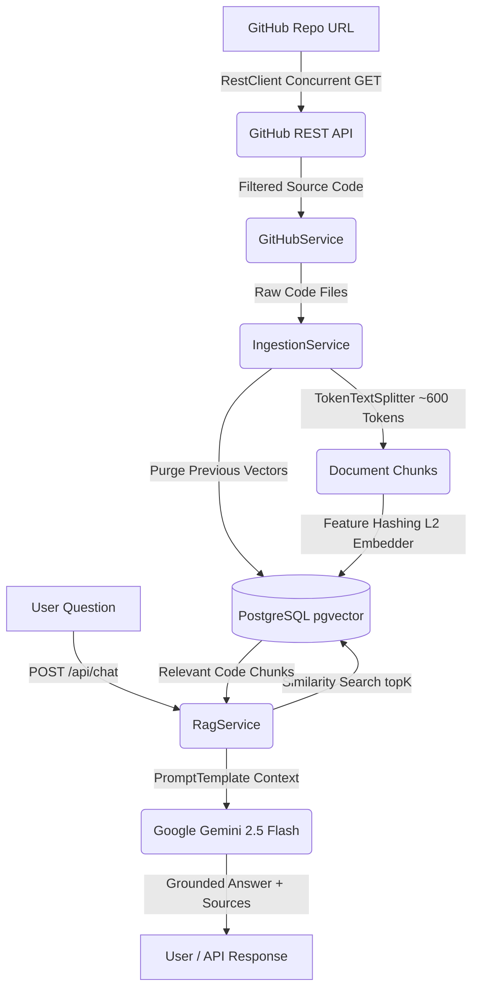

# GitRepAnalyser: Enterprise-Grade GitHub Code Chatbot (RAG Engine)

An enterprise-grade Retrieval-Augmented Generation (RAG) system built with **Java Spring Boot 3.3.0**, **Spring AI**, **Dockerized PostgreSQL (pgvector)**, and **Google Gemini AI**. 

GitRepAnalyser recursively ingests open-source or private GitHub code repositories, chunks and embeds source code into a vector database, and allows developers to converse with their codebase via semantic similarity search and LLM context generation.

---

## 🏗️ Architecture & RAG Pipeline



---

## 🛠️ Technology Stack

- **Language & Runtime:** Java 17
- **Framework:** Spring Boot 3.3.0
- **AI Orchestration:** Spring AI (1.0.0-M1 BOM)
- **Vector Database:** PostgreSQL 16 + `pgvector` extension (Dockerized)
- **LLM Engine:** Google Gemini 2.5 Flash (`gemini-2.5-flash` / `gemini-flash-latest`)
- **HTTP Client:** Spring Framework `RestClient` (Synchronous & Concurrent Parallel Execution)
- **Build Tool:** Apache Maven

---

## 🚀 Complete Project Progress & Implementation Steps

### Phase 1: Infrastructure Setup
1. **Dockerized PostgreSQL with `pgvector`**:
   - Initialized container (`chatbot_db`) using image `pgvector/pgvector:pg16`.
   - Configured port mapping `5433:5432` to resolve Windows port collisions with native `postgres.exe` services.
   - Initialized vector extension (`CREATE EXTENSION IF NOT EXISTS vector;`).

### Phase 2: GitHub Integration Service (`GitHubService`)
1. **URL Extraction**:
   - Formatted robust regex matcher to extract `[owner, repo]` from URLs like `https://github.com/owner/repo.git`, `https://github.com/owner/repo/`, or `owner/repo`.
2. **Concurrent File Fetching (5x-10x Speedup)**:
   - Implemented `parallelStream()` REST calls to download repository source code concurrently over HTTP.
3. **Smart Code Filtering**:
   - **Allowed**: Source code & configuration (`.java`, `.js`, `.ts`, `.py`, `.html`, `.css`, `.json`, `.sql`, `Dockerfile`, etc.).
   - **Excluded**: Lockfiles (`package-lock.json`, `yarn.lock`), binaries (`.png`, `.jar`, `.pdf`, `.zip`), and build/metadata directories (`.git/`, `node_modules/`, `target/`, `build/`).
4. **Rate Limit Authentication**:
   - Injected `github.token=${GITHUB_TOKEN:}` into `Authorization: Bearer <token>` headers, raising rate limits from 60 to 5,000 requests/hour.

### Phase 3: Retrieval & Generation Pipeline (RAG Engine)
1. **Single Active Repository Ingestion (`IngestionService.java`)**:
   - Purges previous vector records (`TRUNCATE TABLE vector_store`) automatically on each ingestion to guarantee single active repository focus and maximum search performance.
   - Tokenizes code files into ~600 token chunks using `TokenTextSplitter`.
2. **Feature Hashing L2 Vector Embedder (`EmbeddingConfig.java`)**:
   - Generates deterministic, normalized 1536-dimensional vector embeddings based on word frequencies and character n-gram feature hashing for precise `pgvector` similarity search.
3. **Direct Gemini 2.5 Flash REST Integration (`RagService.java`)**:
   - Performs topK similarity search in `pgvector`.
   - Assembles grounded context prompts and queries Google Gemini 2.5 Flash via `RestClient`.
   - Provides fast completion responses (~1-2 seconds) with attributed source file paths.
4. **REST Controllers & Exception Handling (`RagController.java` & `GlobalExceptionHandler.java`)**:
   - `POST /api/ingest`: Triggers clean ingestion and vector embedding.
   - `POST /api/chat`: Executes vector retrieval and LLM Q&A.
   - `GlobalExceptionHandler`: Catches errors and returns clean, structured JSON messages.

---

## 🔑 Key Architectural Concepts

### 1. Single Active Repository Mode
- Automatically clears outdated vector entries when ingesting a new repository.
- Prevents database clutter and guarantees zero context pollution between different projects.

### 2. Token Text Chunking
- Splits code into ~600-token segments with 100-token overlap.
- Retains syntactic code logic spanning across chunk boundaries.

### 3. Grounded RAG Prompts
- Enforces strict rules preventing LLM hallucination: if the retrieved code context is empty or incomplete, Gemini acknowledges missing details rather than fabricating code.

### 4. Port Collision Avoidance
- Maps Docker PostgreSQL to host port `5433` to eliminate conflicts with local Windows PostgreSQL installations running on port `5432`.

---

## ⚙️ How to Run & Test

### 1. Start Docker Container
```bash
docker compose -f github-code-chatbot/docker-compose.yml up -d
```

### 2. Set Environment Variables (PowerShell)
```powershell
$env:GITHUB_TOKEN="your_github_personal_access_token"
$env:GEMINI_API_KEY="your_google_gemini_api_key"
```

### 3. Run Executable Application
```bash
mvn clean package -DskipTests -f github-chatbot/pom.xml
java -jar github-chatbot/target/github-chatbot-0.0.1-SNAPSHOT.jar
```

---

## 🧪 Verified Live API Test Results

### 1. Ingest Repository (`POST http://localhost:8081/api/ingest`)
**Request Body:**
```json
{
  "url": "https://github.com/octocat/Spoon-Knife"
}
```

**Response:**
```json
{
  "status": "SUCCESS",
  "message": "Repository successfully ingested and embedded into vector store.",
  "ingestedChunks": 3,
  "repositoryUrl": "https://github.com/octocat/Spoon-Knife"
}
```

### 2. Ask Question (`POST http://localhost:8081/api/chat`)
**Request Body:**
```json
{
  "question": "What is the purpose of index.html and styles.css in this project?",
  "topK": 4
}
```

**Verified Response:**
```json
{
  "answer": "Based on the provided context, `index.html` and `styles.css` form a minimal demonstration web page designed for users to practice making changes and submitting pull requests when forking the repository...\n\n### 1. `index.html`\n- Links stylesheet: `<LINK href=\"styles.css\" rel=\"stylesheet\" type=\"text/css\">\n- Displays image: ``\n\n### 2. `styles.css`\n- Resets default padding/margins: `* { margin:0px; padding:0px; }`\n- Styles Octocat image (`#octocat`): width 384px, centered.\n- Styles text (`p`): width 400px, custom monospace font family.",
  "sources": [
    "README.md",
    "index.html",
    "styles.css"
  ]
}
```
